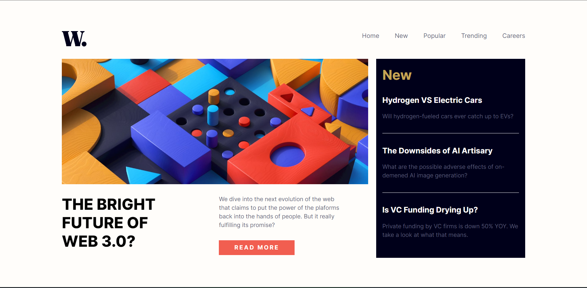

# News-Homepage
<h3> Screenshot </h3>

# Frontend Mentor - News homepage solution

This is a solution to the [News homepage challenge on Frontend Mentor](https://www.frontendmentor.io/challenges/news-homepage-H6SWTa1MFl). 
Frontend Mentor challenges help you improve your coding skills by building realistic projects. 

## Table of contents

- [Overview](#overview)
  - [The challenge](#the-challenge)
  - [Links](#links)
- [My process](#my-process)
  - [Built with](#built-with)
  - [What I learned](#what-i-learned)
  - [Continued development](#continued-development)
  - [Useful resources](#useful-resources)
- [Acknowledgments](#acknowledgments)

### The challenge

Users should be able to:

- View the optimal layout for the interface depending on their device's screen size
- See hover and focus states for all interactive elements on the page

### Links

- Solution URL: https://github.com/einstyr/News-Homepage
- Live Site URL: https://einstyr.github.io/News-Homepage/

## My process

### Built with

- Semantic HTML5 markup
- CSS custom properties
- Flexbox
- CSS Grid

### What I learned

I dived into CSS Grid and Flexbox which helped me to rearrange sections. It was more enjoyable 
to control and manipulate layout with confidance and theoretical basis. 

### Continued development

I definitely need to learn a lot and sharpen my skills about "Mobile First" development which is new for me.
Also, proper Html markup and flat code will be my future goal.

### Useful resources

- [Resource 1] https://www.youtube.com/watch?v=rg7Fvvl3taU&list=PLBfPMm-MDlGocTuzh1JGEBE8gdQ_zxrup&index=11&t=2s&ab_channel=KevinPowell
It was very simple and helpful tutorial, which helped me on the way.

- [Resource 2] https://www.youtube.com/watch?v=u044iM9xsWU&list=PLBfPMm-MDlGocTuzh1JGEBE8gdQ_zxrup&index=36&t=312s&ab_channel=KevinPowell
I mostly used Grid system but Flexbox was usefull time to time.

## Acknowledgments

- Kevin Powell video tutorials and online courses helped me to fix some problems. Mostly mobile navigation menu.

